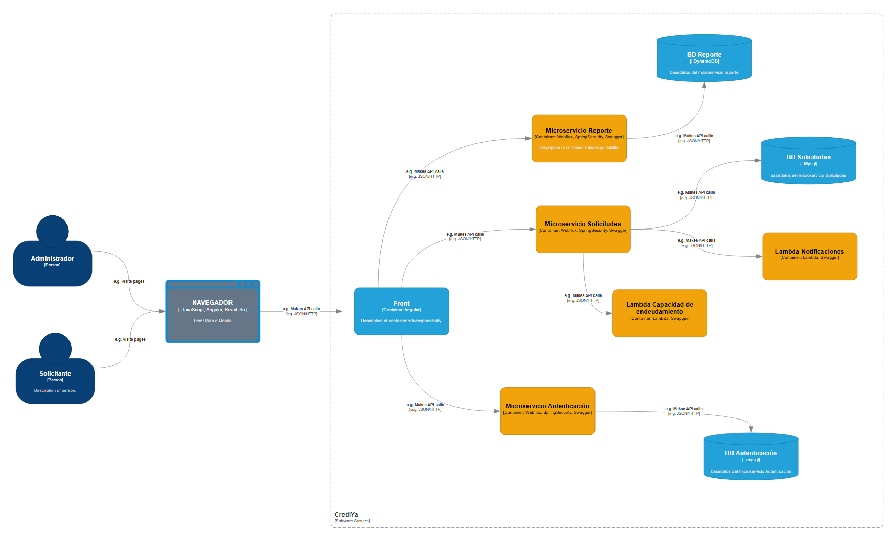
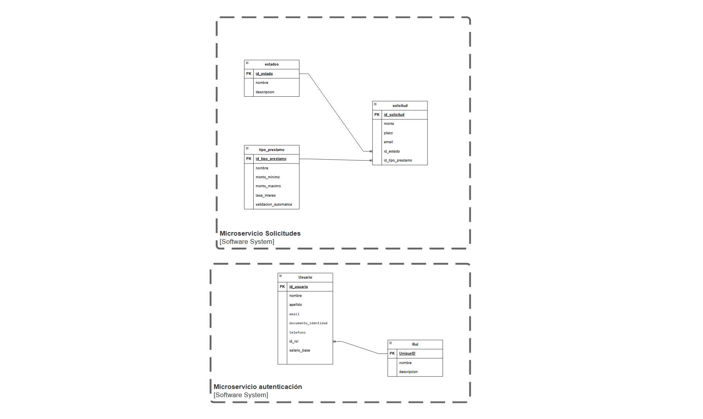
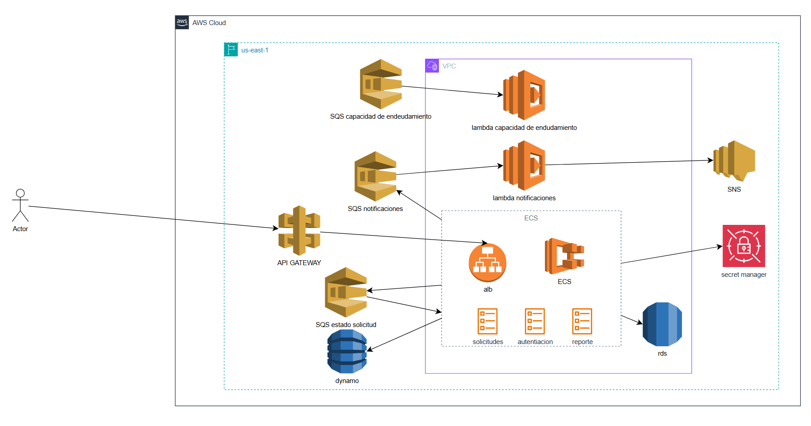

# CrediYa

"CrediYa" es una plataforma que busca digitalizar y optimizar la gestión de solicitudes de préstamos personales, eliminando la necesidad de procesos manuales y presenciales.

El sistema debe permitir a los **solicitantes** ingresar sus datos y la información del préstamo que desean. Una vez enviada, el sistema se encargará de una **evaluación inicial automatizada** para determinar si la solicitud es viable. Posteriormente, un **administrador** podrá revisar los casos pre-aprobados y tomar una decisión final.

La plataforma debe incluir funcionalidades clave como:

- **Gestión de tipos de préstamos:** Los administradores pueden crear, editar y eliminar los productos de crédito que se ofrecen.
- **Proceso de solicitud:** Los solicitantes pueden enviar sus datos y la información del préstamo deseado.
- **apacidad de endeudamiento:** El sistema evalúa automáticamente las solicitudes para aprobar o rechazar.
- **Gestión de usuarios:** Habrá distintos roles, como solicitantes y administradores, cada uno con diferentes permisos y funcionalidades.
- **Notificaciones automáticas:** El sistema notifica a los solicitantes sobre el estado de su crédito.
- **Reportes de rendimiento:** Los administradores tendrán acceso a informes sobre el desempeño del negocio, como el total de préstamos aprobados.

Una de las funcionalidades centrales es la capacidad de agilizar el proceso de solicitud, brindando una experiencia eficiente y transparente para todos los usuarios.

## Arquitectura y Metodología

La solución debe ser implementada como un sistema de **microservicios**, donde cada servicio es un componente independiente que se comunica a través de mecanismos asíncronos y síncronos.

Las reglas y consideraciones técnicas a tener en cuenta para el desarrollo son las siguientes:

- Cada microservicio debe ser un repositorio aparte.
- La arquitectura del back-end debe estar basada en el modelo **hexagonal**.
- Los microservicios deben estar desarrollados con **WebFlux**.
- Cada HU debe estar implementada en su rama única (usar de gitflow).
- Se debe usar **SonarLint** para la validación del código.
- Cada api que se desarrolle debe usar **Swagger** para documentar.
- Se deben hacer **Test unitarios**.
- Las funcionalidades deben seguir buenas prácticas de programación (nombramiento de variables, manejo de constantes, métodos no muy grandes).
- La comunicación asíncrona debe realizarse usando colas de mensajes como **SQS**.
- El despliegue de la solución se realizará en **AWS** de forma manual usando **ECS con Fargate** y **API Gateway**.
- Se utilizarán bases de datos relacionales (**RDS**) para la persistencia de datos transaccionales, y bases de datos no relacionales (**DynamoDB**) para datos de reportes.
- Para el control de versiones y el ciclo de CI/CD se usará **Docker** y **AWS ECR**.

## Diseño

### Flujo de desarrollo

### Arquitectura

### Base de datos relacionales

### Base de datos no relacional

### Infraestructura

